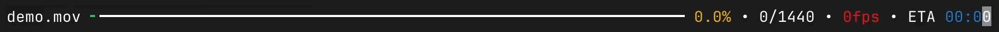

# FFmpeg Progress Bar

A beautiful, rich-style progress bar for FFmpeg with colored output.




## Features

- 🎨 **Rich-style progress bar** with smooth animations
- 📏 **Dynamic terminal width detection** - automatically adjusts to your terminal size
- 🌈 **Colored output** - yellow percentage, red FPS, blue ETA, green progress
- ⚡ **Real-time updates** - shows current progress, frame rate, and estimated time
- 🖥️ **Cross-platform** - works on Windows, macOS, and Linux
- 📱 **Responsive** - adapts when you resize your terminal window
- 🎯 **Filename truncation** - handles long filenames gracefully

## Installation

### Option 1: Download Pre-built Binary (Recommended)

1. Go to the [Releases](../../releases) page
2. Download the binary for your operating system:
   - `fpb-windows-amd64.exe` (Windows)
   - `fpb-darwin-amd64` (macOS Intel)
   - `fpb-darwin-arm64` (macOS Apple Silicon)
   - `fpb-linux-amd64` (Linux)

### Option 2: Build from Source

#### Prerequisites

- [Go 1.18+](https://golang.org/dl/)
- [FFmpeg](https://ffmpeg.org/download.html) installed and accessible in your PATH

#### Build Steps

1. **Clone the repository:**
   ```bash
   git clone https://github.com/yourusername/fpb.git
   cd fpb
   ```

2. **Install dependencies:**
   ```bash
   go mod init fpb
   go get golang.org/x/term
   ```

3. **Build the binary:**
   ```bash
   # For your current platform
   go build -o fpb fpb.go
   
   # For specific platforms
   GOOS=windows GOARCH=amd64 go build -o fpb-windows-amd64.exe fpb.go
   GOOS=darwin GOARCH=amd64 go build -o fpb-darwin-amd64 fpb.go
   GOOS=darwin GOARCH=arm64 go build -o fpb-darwin-arm64 fpb.go
   GOOS=linux GOARCH=amd64 go build -o fpb-linux-amd64 fpb.go
   ```

## Usage

Simply replace `ffmpeg` with `fpb` in your commands:

```bash
# Instead of:
ffmpeg -i input.mp4 -c:v libx264 -crf 23 output.mp4

# Use:
./fpb -i input.mp4 -c:v libx264 -crf 23 output.mp4
```

### Examples

**Basic video conversion:**
```bash
./fpb -i movie.avi -c:v libx264 -c:a aac movie.mp4
```

**Extract audio:**
```bash
./fpb -i video.mp4 -vn -c:a copy audio.aac
```

**Resize video:**
```bash
./fpb -i input.mp4 -vf scale=1280:720 -c:v libx264 -crf 23 output.mp4
```

**Convert with custom settings:**
```bash
./fpb -i input.mov -c:v libx265 -preset medium -crf 28 -c:a aac -b:a 128k output.mp4
```

## Installation Tips

### macOS
```bash
# Make the binary executable
chmod +x fpb-darwin-*

# Move to a directory in your PATH (optional)
sudo mv fpb-darwin-* /usr/local/bin/fpb
```

### Linux
```bash
# Make the binary executable
chmod +x fpb-linux-amd64

# Move to a directory in your PATH (optional)
sudo mv fpb-linux-amd64 /usr/local/bin/fpb
```

### Windows
1. Download `fpb-windows-amd64.exe`
2. Rename to `fpb.exe`
3. Add to your PATH or run from the same directory

## Requirements

- **FFmpeg** must be installed and accessible via command line
- **Terminal with Unicode support** for best visual experience
- **Minimum 20 column terminal width**

## How It Works

1. **Wraps FFmpeg** - Passes all arguments directly to FFmpeg
2. **Parses output** - Extracts duration, progress, and FPS from FFmpeg's stderr
3. **Renders progress** - Creates a beautiful progress bar that updates in real-time
4. **Dynamic sizing** - Automatically adjusts to your terminal width

## Troubleshooting

### Colors not showing
- Ensure your terminal supports ANSI color codes
- On Windows, use Windows Terminal or PowerShell 7+

### Progress bar too small/large
- The bar automatically adjusts to terminal width
- Try resizing your terminal window

### Permission denied (macOS/Linux)
```bash
chmod +x fpb
```

### FFmpeg not found
- Make sure FFmpeg is installed: `ffmpeg -version`
- Add FFmpeg to your system PATH

## Technical Details

- **Language**: Go 1.18+
- **Dependencies**: `golang.org/x/term` for terminal size detection
- **Color Support**: Automatic detection with graceful fallback
- **Update Rate**: 50ms for smooth animations
- **Unicode**: Full support for rich progress characters

## Contributing

1. Fork the repository
2. Create a feature branch (`git checkout -b feature/amazing-feature`)
3. Commit your changes (`git commit -m 'Add amazing feature'`)
4. Push to the branch (`git push origin feature/amazing-feature`)
5. Open a Pull Request

## License

This project is licensed under the MIT License - see the [LICENSE](LICENSE) file for details.

## Acknowledgments

- Inspired by Python's `rich` library progress bars and Martin Larralde (althonos) `ffpb`
- Built with Go's excellent `golang.org/x/term` package
- Thanks to the FFmpeg team for their amazing tool

## Star History

If you find this project useful, please consider giving it a ⭐!

---

**Made with ❤️ and Go**
